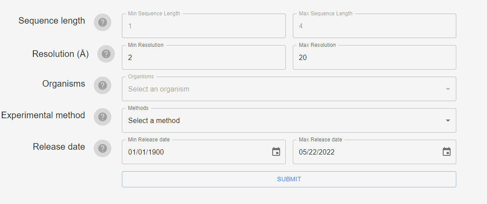

# Prerequisites
## Download RNAnetdb sqlite3 database
To use this app, you need to download RNAnetdb sqlite3 database by clicking [here](https://entrepot.ibisc.univ-evry.fr/f/affcebef9e504a65a771/?dl=1).
## Clone the projet
```git clone https://github.com/mamadou-niakate/rnanetdb.git```
## Install dependencies
type ```npm install``` from your terminal
### Create an ```.env``` file at the root of your project and add the ```DATABASE_PATH``` variable, with the path of the downloaded database on your machine
```DATABASE_PATH=the_path_of_the_downloaded_database``` 
> If your system is ***Windows***, do not forget to escape the \, for exemple:``` DATABASE_PATH=C:\\Users\\connected_user\\Downloads\\RNANet.db```
## Run the app
### Run server
```npm run dev```
### Run client
```cd views``` then ```npm start```

# How to use the app
## Select criteria

## Visualize structures in table

## Visualize structures on graph

## Download db

## Database Design
